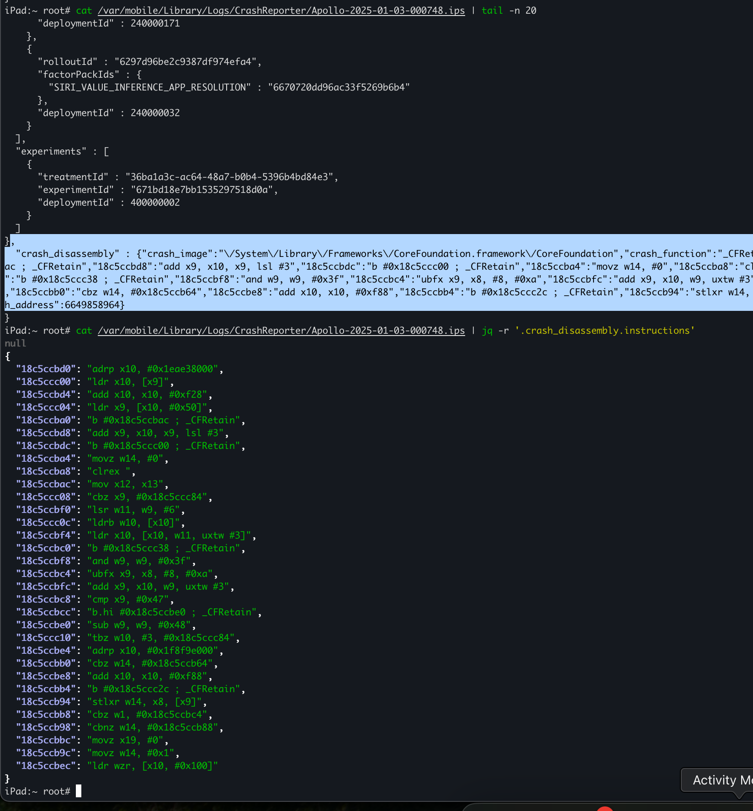
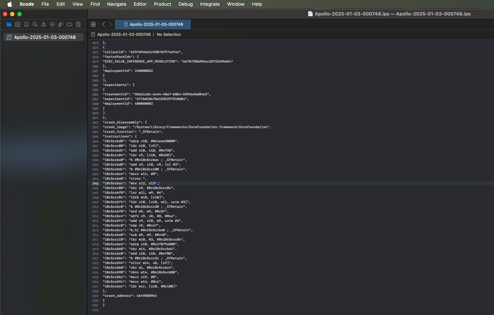

A jailbreak tweak that improves iOS crash reports by adding disassembled instructions, annotated with symbolicated function names and memory peeking, to crash report files.

## Installation

Note: not all jbs/tweakloaders support injecting stuff into `ReportCrash`. You may need to manually inject the tweak 

## Credits

- [Capstone Engine](https://www.capstone-engine.org/) for disassembling instructions

### Output

#### .ips files include disassembled instructions
```
iPad:~ root# cat /var/mobile/Library/Logs/CrashReporter/Apollo-2025-01-03-000748.ips | jq -r '.crash_disassembly.instructions'
null
{
  "18c5ccbd0": "adrp x10, #0x1eae38000",
  "18c5ccc00": "ldr x10, [x9]",
  "18c5ccbd4": "add x10, x10, #0xf28",
  "18c5ccc04": "ldr x9, [x10, #0x50]",
  "18c5ccba0": "b #0x18c5ccbac ; _CFRetain",
  "18c5ccbd8": "add x9, x10, x9, lsl #3",
  "18c5ccbdc": "b #0x18c5ccc00 ; _CFRetain",
  "18c5ccba4": "movz w14, #0",
  "18c5ccba8": "clrex ",
  "18c5ccbac": "mov x12, x13",
  "18c5ccc08": "cbz x9, #0x18c5ccc84",
  "18c5ccbf0": "lsr w11, w9, #6",
  "18c5ccc0c": "ldrb w10, [x10]",
  "18c5ccbf4": "ldr x10, [x10, w11, uxtw #3]",
  "18c5ccbc0": "b #0x18c5ccc38 ; _CFRetain",
  "18c5ccbf8": "and w9, w9, #0x3f",
  "18c5ccbc4": "ubfx x9, x8, #8, #0xa",
  "18c5ccbfc": "add x9, x10, w9, uxtw #3",
  "18c5ccbc8": "cmp x9, #0x47",
  "18c5ccbcc": "b.hi #0x18c5ccbe0 ; _CFRetain",
  "18c5ccbe0": "sub w9, w9, #0x48",
  "18c5ccc10": "tbz w10, #3, #0x18c5ccc84",
  "18c5ccbe4": "adrp x10, #0x1f8f9e000",
  "18c5ccbb0": "cbz w14, #0x18c5ccb64",
  "18c5ccbe8": "add x10, x10, #0xf88",
  "18c5ccbb4": "b #0x18c5ccc2c ; _CFRetain",
  "18c5ccb94": "stlxr w14, x8, [x9]",
  "18c5ccbb8": "cbz w1, #0x18c5ccbc4",
  "18c5ccb98": "cbnz w14, #0x18c5ccb88",
  "18c5ccbbc": "movz x19, #0",
  "18c5ccb9c": "movz w14, #0x1",
  "18c5ccbec": "ldr wzr, [x10, #0x100]"
}
```



#### Visible in Xcode's crash report viewer

